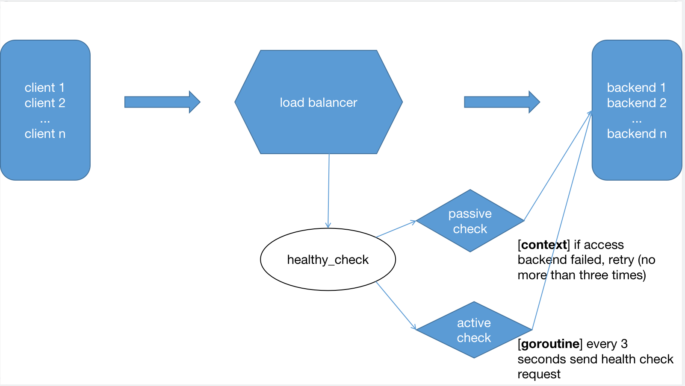

# 背景

## 为什么要做这个项目？

1. [熟悉分布式系统相关领域，load balancer 在分布式系统中的重要性](http://www.aosabook.org/en/distsys.html#fig.distsys.1)
    - **反向代理**是什么
    - 分布式锁怎么做？
    - lb如何工作，哪些方面需要注意？

2. 不需要策略非常完善，简单的RR（round-robin）即可。日后进行优化 ---> 哪些潜在的优化点？
    1. balance 的策略
        - least_conn
    2. 收集统计数据（比如连接/反应时间），动态调整权重
    3. command line(argv) -> config file parse

3. 增加对 Go 语言的熟悉程度
    - sync/lock
    - http/http_util/http_test
        - context
        - NewServer
        - reverse proxy

## 负载均衡相关算法

### RR / SRR

场景：
1. 平均分配负载，让每个 server 上的 request 大致相同。
2. 最简单的 scale out。机器性能已知，功能相同。

劣势：
无法动态分配（real-time data），比如：
1. CPU/memory/disk...
2. qps...

### least_conn

首选遍历后端集群，比较每个后端的conns/weight，选取该值最小的后端。
如果有多个后端的conns/weight值同为最小的，那么对它们采用加权轮询算法。

这里主要区别就是对 conns 数据的关注
1. 每个 worker 上的连接数需要记录（配置中有最大上限）
2. 比较简单的动态分配算法，动态关注 conns

[How Nginx is tracking number of connections for least_conn load balancing?](https://stackoverflow.com/questions/35000888/how-nginx-is-tracking-number-of-connections-for-least-conn-load-balancing)

### 一致性hash

> 当后端是**缓存服务器**时，经常使用一致性哈希算法来进行负载均衡。
> 使用一致性哈希的好处在于，增减集群的缓存服务器时，只有少量的缓存会失效，回源量较小。
> 在nginx+ats / haproxy+squid等CDN架构中，nginx/haproxy所使用的负载均衡算法便是一致性哈希

简单理解一下就是减少 cache miss （分布式缓存 server 场景下）

为什么不会产生不必要的 cache miss ？

hash 的本质过程是什么？通过 hash 函数对 input 进行一些计算得到 output 。分布式场景下肯定是有机器数的，根据机器 id 将 request 打到不同的 server 上。如果某个机器 down 掉了，一般的缓存函数是不是就失效了？那么一致性哈希是如何做到的？
- When you add a cache machine, then object o will be cached into the machine:  `hash(o) mod (n+1)`
- When you remove a cache machine, then object o will be cached into the machine:   `hash(o) mod (n-1)`

[TODO 一致性hash介绍](https://www.codeproject.com/Articles/56138/Consistent-hashing)
[nginx - consistent_hashing]https://blog.csdn.net/zhangskd/article/details/50256111

其中数学原理需要进一步学习，但是其使用场景（**分布式缓存，负载均衡**），在工程上是必须知道的。

# 设计目标

1. 能够简单的进行负载均衡（作为一个组件足够了）
    - 【基本功能】  能够完成基本的 reverse proxy 的功能，进行 request/response 的转发。
    - 【正确】     能够正确的（health）找到 next server
    - 【高并发】   能够保证足够多的 request 找到 next server

##  实现的功能

### 调研

1. handler 的形式： `func handler(writer, request)`。
2. reverse proxy 存在现成的API： `httputil.NewSingleHostReverseProxy(serverUrl)`
3. 错误处理（转发不成功）： `proxy.ErrorHandler(writer, request, error)`
4. find next backend
    - get next index
        - `atomAdd()`
    - check backend is health
        - `bool isAlive`
        - `setAliveByBackend()`
        - `setAliveByUrl()`
3. healthCheck
    - static check
        - isAlive
        - run checking function in backend (**Goroutine**)
    - ErrorHandler
        - **context**
            - retry
            - attempt

4. high concurrency
    - RWLock
    - atom add

# 设计思路及折衷

1. 关于`get_next_peer`，目前是RR/SRR。
2. 关于健康检查，有积极和消极两种方式.
    - 通过 Goroutine 在 backend 进行检查。(for all backend)
    - 通过 retry 对同一个backend进行重试，通过 attempts 轮询不同的 backend ，直到找到正常运行的 backend ，或 `attempts > {MAX_ATTEMPTS_NUMS}`。

## reverse proxy

[Example: nginx + flask](https://stackoverflow.com/questions/62945229/nginx-reverse-proxy-for-python-app-using-docker-compose)

## Smooth Round Robin(SRR)

nginx 默认的负载均衡算法。

REFS:
- https://www.nginx.com/resources/glossary/round-robin-load-balancing/
- https://github.com/phusion/nginx/commit/27e94984486058d73157038f7950a0a36ecc6e35
- https://blog.csdn.net/zhangskd/article/details/50194069

### 相对于 sample RR 有什么改进？

1. 关于增加权重
> **Weighted round robin** – A weight is assigned to each server based on criteria chosen by the site administrator; the most commonly used criterion is the server’s traffic‑handling capacity. The higher the weight, the larger the proportion of client requests the server receives. If, for example, server A is assigned a weight of 3 and server B a weight of 1, the load balancer forwards 3 requests to server A for each 1 it sends to server B.

2. 错误处理，动态调整权重（`effective_weight`）

### 还有什么其他可以改进的地方？

#### least_conn

轮询算法，是把请求平均的转发给各个后端，使它们的负载大致相同。
这有个前提，就是**每个请求所占用的后端时间要差不多**，如果有些请求占用的时间很长，会导致其所在的后端负载较高。
在这种场景下，**把请求转发给连接数较少的后端，能够达到更好的负载均衡效果**。

least_conn算法很简单，
1. 首选遍历后端集群，比较每个后端的conns/weight，选取该值最小的后端。
2. 如果有多个后端的conns/weight值同为最小的，那么对它们采用加权轮询算法。

#### Dynamic round robin

> [Dynamic round robin – A weight is assigned to each server dynamically, based on real‑time data about the server’s current load and idle capacity.](https://www.nginx.com/resources/glossary/round-robin-load-balancing/)

主要思想就是根据后端服务器实时的数据（CPU/MEMORY/DISK...）进行动态调整权重。

[REF repo](https://github.com/akshah1997/Dynamic-Round-Robin-Scheduling)

# 系统设计

## 基本介绍

- 高并发的 client 访问 lb ，会访问临界区 `current`，需要加 lock。
- request 获得到了相匹配的 server 之后，需要**尝试**发消息，消息不一定能传到（需要错误处理，调整权重）

## 系统流程图及说明

### 相关的一些功能

lb:
- get request 
- return response
- raise Exception('access failed.')

reverse proxy:
- send request to backend
- get response from backend
- handler func

get_next_index:
- get current index from pool
- (atom) set next index (+1) 

health check
- active
    - while True, i += 1, i %= len(backend), check backend[i]
    - set status
    - check next backend
- passive
    - get backend object
    - access backend
    - (get retry number from context)
    - if failed, retry
    - if retry more than three time, set False
    - TODO attempt, how to use it?

## check list

> 《code complete 2》

### 1. 与外部系统的接口

parse url of backend server from command line.

##### 输入

格式：request
来源：作为server，肯定是监听某个 ip + port

##### 输出

格式：response
来源：作为backend的client
- 选择backend ==> ip + port
- 转发request
- 获取response，并转发response

### 2. 错误恢复、处理、错误信息保存

1. log要做好
2. 每个阶段验证数据是否正常
    - 正常发送
    - 异常发送（error、exception）
    - 正常接收
    - 异常接收（error、exception）

### 3. 吞吐量

TODO test, 1 + n

### 4. time about health checking

1. 主动检查, 10 millseconds
2. 被动检查, 10 minutes

### 5. 用户唯一关心的就是能接受到正常的 response

1. backend可以返回 `response(backend_name)` 作为验证
2. TODO 大量的吞吐情况下，如何更大程度的减少瓶颈（原子操作 + 锁带来的损失）

### 6. 独立测试？

1. rp 的测试方式。本质就是作为一个client
2. get_next:
    - 测试其原子性
3. set_alive/get_alive
    - 测试其同步性
4. 测试数据结构设计的正确性
5. health check
    - retry次数过多怎么办？直接设置为false（这也是我的目的）
5. 对于返回错误的地方
    - 直接终止？
    - 解决问题 + 记录？

### 7. 模块定义是否清楚？

交互过程还是很清晰的，部件不多。

### 8. 是否有可能的改动？

1. 目前一切基本都是确定的
2. 其实相互之间的接口还是比较模糊。关于参数是什么，返回值是什么？还是没有定义好。

## 数据结构及说明

struct: 
- Backend:
    - URL
    - ALIVE
    - ReverseProxy
    - Weight / EffectWeight / CurrentWeight
- BackendPool
    - currentBackendIndex
    - list of {Backend}

## 异常处理

### health check

#### active 

1. 超过 retry
2. 超过 attempt

#### passive

1. 尝试建立链接失败，直接设置为 False
